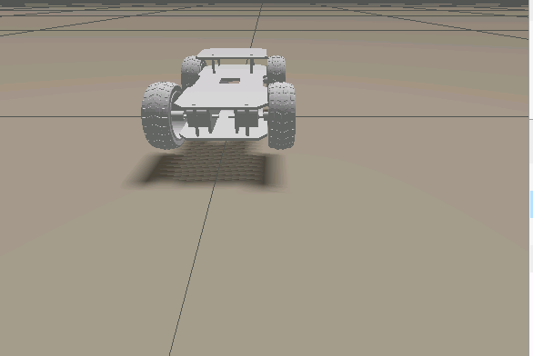

# Autonomous Industrial Inspection Robot

This repository serves as a step-by-step guide for developing an autonomous robot for industrial environments. The project is divided into logical phases, from mechanical design to sensor integration.

## Phase 1: Environment & Mechanical Design

Before starting, ensure your workstation is running **Ubuntu (or WSL 2)** with **ROS 2 Jazzy** installed.

### 1. 3D Modeling

Design your robot's chassis, wheels, and mounts using a CAD tool like **Blender**.

#### Links & Joints

- Assign **mass** and **inertia tensors** to all links.

#### Joint Types

- Use **continuous joints** for wheels  
- Use **revolute joints** for moving parts  

---

### 2. URDF Generation

Use the **Phobos add-on** to export your 3D model into a **URDF (Unified Robot Description Format)**.

---

## Phase 2: Simulation & Physics

Once the URDF is validated, it is spawned into a physics engine to test interactions.

### Gazebo Simulation

Below is a preview of the robot in the simulation environment:

  

#### Launch Files

Create a ROS 2 launch file to automate the spawning process.

#### Physics Check

- Verify gravity is correctly applied  
- Ensure proper ground contact with robot meshes  

---

> TIP:  
> Low Hardware? Use GitHub Codespaces  
>
> If your laptop struggles to run Gazebo locally, use GitHub Codespaces.  
> By configuring a `.devcontainer` with ROS 2 and VNC support, you can run the entire simulation in the cloud and view the GUI in your browser.

---

## Phase 3: Control & Sensor Integration

With a stable robot in a clear environment, we begin adding locomotion and data streams.

### Locomotion

Implement ROS 2 nodes to publish velocity commands and test movement across the factory floor.

### Sensor Plugins

- Attach **LiDAR** and **RGB Camera** plugins to the URDF  

Even in an empty world:
- LiDAR detects surfaces (e.g., floor, walls)  
- Camera streams the environment  

### Verification

Use **RViz2** to confirm active topics